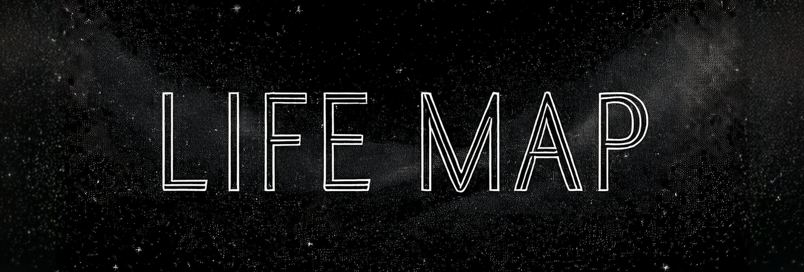

<div align="center">
<div align="center">
    
    
## Visualize and create your personal networks

</div>


</div>

## Description

LifeMap is a web application that allows you to create and visualize your personal networks. You can add nodes representing different aspects of your life, such as education, work experience, hobbies, dreams, and family, and connect them to visualize relationships and dependencies.
<div align="center">


<div align="center">
    <a href="https://kuberwastaken.github.io/LifeMap" target="_blank">
        
    </a>
</div>

</div>


## How to Use It

1. **Start Your Mind Map**: Enter your name to create the main node.
2. **Add Nodes**: Click on nodes to select them, and use the action panel to add child nodes.
3. **Connect Nodes**: Enable connect mode to link nodes together.
4. **Edit Nodes**: Double-click on nodes to edit their labels.
5. **Save and Load**: Use the top bar buttons to save your mind map to a file or load an existing one.

## How to Build It Locally

1. **Clone the repository**:
    ```sh
    git clone https://github.com/kuberwastaken/LifeMap.git
    cd LifeMap
    ```

2. **Install dependencies**:
    ```sh
    npm install
    ```

3. **Start the development server**:
    ```sh
    npm start
    ```

4. **Build the project**:
    ```sh
    npm run build
    ```

## File Description

- `index.html`: The main HTML file for the application.
- `index.js`: The entry point for the React application.
- `App.js`: The main application component.
- `LifeMap.js`: The core component for creating and visualizing the mind map.
- `LifeMap.css`: The CSS file for styling the LifeMap component.

## How Saving Works

LifeMap allows you to save your mind map to local storage and download it as a JSON file. You can also load a previously saved mind map from a JSON file.

## Open Source Contributions

We welcome contributions from the community. Feel free to fork the repository, make changes, and submit a pull request.

## Acknowledgements

- I would like to thank Dr. Edward Rogers for his session on importance of a LifeMap like such in life, it was a huge inspiration behind this project.
- Also, I would love to thank my undiagnosed ADHD for impulsively jumping on the idea as soon as the session ended.

## License

This project is licensed under the MIT License. See the [LICENSE](LICENSE) file for details.